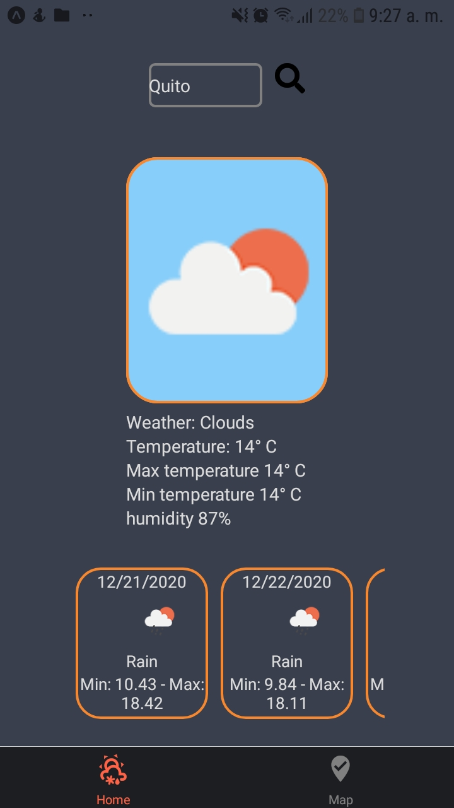
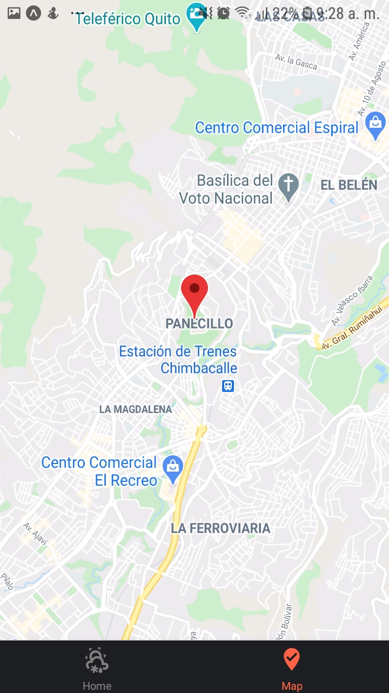

## React Native Weather App 

Just a small weather app I did to test my react native skills using ReactNavigation, mapbox, openweather map and google maps.

this app has the following features: 
* location. 
* search a city to get the weather and the forecast of the following 5 days. 
* a map view to show your current location or the city you have search of. 

the use bottom tabs to navigate among the two screens as can be seen in the following screenshots. 

    

you can test the app by using the expo client and scanning the code [here](https://expo.io/@alexc957/projects/weatherApp)
